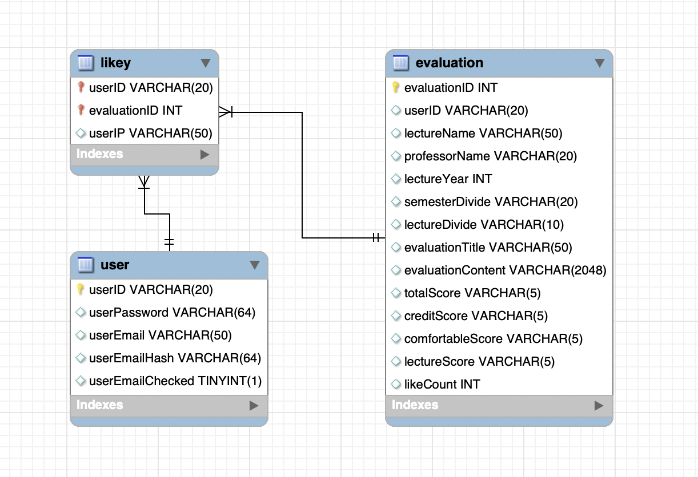

# LectureEvaluation : 강의 평가 웹사이트

❓ Problem : 포털 사이트 검색창에 '@@동 카페'로 검색하면, 내가 원하는 분위기의 카페를 찾기 어렵다 😮

‼ Idea : 사용자가 원하는 메뉴와 분위기의 카페를 찾아주는 웹사이트가 있으면 좋지 않을까? 🤔

💯 Solution : 카페마다 카테고리, 메뉴 등을 미리 저장해두고, 사용자가 찾는 카페를 우선으로 보여주자!! 😁

## 주요 기능

- **강의 평가** : 평가하고자 하는 강의와 교수를 등록하기 버튼을 통해 평가 글을 작성할 수 있음.
- **강의 검색** : 검색을 원하는 키워드 또는 강의 구분과 정렬 옵션을 통해 검색할 수 있음.
- **추천 기능** : 자신의 글은 추천할 수 없으며, 게시물당 한 번의 추천만 가능하도록 해 더 신뢰성 있는 강의 추천 서비스가 될 수 있게 함.
- **페이징 기능** : 한 페이지에 5개의 강의 평가 글을 노출시키고 페이지를 넘겨 다음 평가 글을 볼 수 있게 해 서비스의 가독성을 높임.
- **이메일 인증 기능** : javaMail과 activation을 사용해 SMTP를 통한 메일 인증 기능을 통해 인증된 사용자만 서비스를 이용할 수 있게 함.
- **신고 기능** : 부적절한 평가 글을 신고해 관리자에게 신고 메일을 전송할 수 있게 함. 이메일 인증 기능 로직과 같은 로직을 적용.

## 기술 스택

- Front
    - BootStrap, popper, css
- Back
    - Java 11, JSP, Spring, MySQL

## 개발 기간

- 2020.7.27 ~ 8.31  (5주)
    

## ERD

